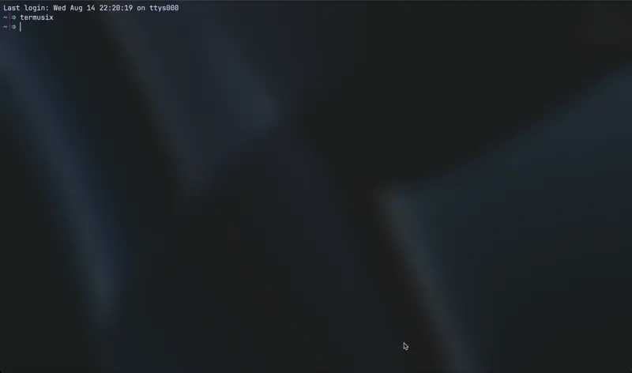

# Termusix Player

[](https://crates.io/crates/termusix)
[](https://github.com/sumoduduk/termusix/actions/workflows/nix-build.yml)



A terminal-based music player with a user-friendly terminal UI, built with Rust.

## Features

- **Simple Interface**: Navigate and play your favorite tracks with ease.
- **Terminal UI**: Enjoy a sleek and minimalistic terminal user interface.
- **High Performance**: Leverage the speed and safety of Rust for a smooth experience.
- **Lightweight**: The file size is around 3.5 MB, and the RAM memory consumption is around 10 MB in release mode.

## Installation

### Arch Linux (via AUR)

- Download the AUR package for termusix: (You can install it with your favourite AUR helper)

```bash
yay -S termusix-bin

```

### MacOS

- **Prerequisites:**

Install Homebrew [brew.sh](https://brew.sh/)

- **Install it:**

```bash
brew tap sumoduduk/tap && brew install termusix

```

### Other OS and Distro

- **Prerequisites:**

1. Rust and Cargo installed on your system. You can find installation instructions at [https://www.rust-lang.org/](https://www.rust-lang.org/).
2. See the requirment for development

- **Install it with cargo:**

  ```bash
  cargo install termusix
  ```

## Usage

Run the app in terminal

`$ termusix`

## Development

To contribute to this project, follow these steps:

1. **Clone the repository**:

   ```sh
   git clone https://github.com/sumoduduk/termusix.git
   cd termusix
   ```

2. **Requirements**:

   - Ensure you have `alsa-lib` installed on your Linux system for audio support.

   On Debian-based systems (e.g., Ubuntu), you can install it using:

   ```sh
   sudo apt-get install libasound2-dev
   ```

   On Red Hat-based systems (e.g., Fedora), use:

   ```sh
   sudo dnf install alsa-lib-devel
   ```

   On NixOS add this to your flake/home-manager/configuration.nix

   ```nix
   pkgs.alsa-lib
   ```

## Contributing

Contributions are welcome! Feel free to open issues or submit pull requests.

## License

This project is licensed under the GPL-3.0-or-later License. See the [LICENSE](LICENSE) file for details.
